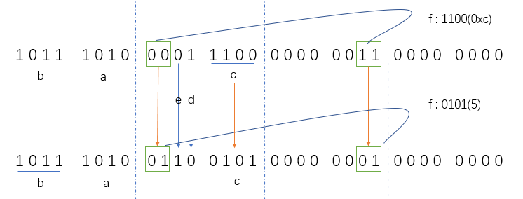

# 结构体位域并发问题

## 0x00 位域并发分析



上图是结构体`BitField`变量`bf`所画，需要根据打印推断出各个位域成员的存储情况，具体代码及打印见`0x01 代码`和`0x02 打印结果`部分。

如上图所示，GCC编译器会对位域成员进行压缩存储（经测试，VS编译器一样会压缩），比如下方示例代码中的位域成员a、b，他们存储在一个字节上。注意位域成员c、d、e及f的低两位，他们存储在一个字节。

计算机是按字节进行操作，即一个字节是基本读写单位。即使是修改一个未占满一个字节的位域成员，计算机同样是覆盖写这个成员所在的整个字节。**因上述原因，当两个或多个线程并发的修改同一个字节上的不同位域成员时，在没有并发保护措施下，存在并发安全问题！**

下面是验证没有并发保护情况下，一个线程修改成员d，三个线程修改成员f。从打印结果看，对d的第三次取反打印为0，应该打印是1。分析如下：

1. 修改d和修改f的线程在彼此都没有执行修改前，两个线程读取第二个字节里存储的都是`0110 0101`
2. 线程调度，切换到修改d的线程，对d取反赋值给d，再覆盖写整个第二个字节，结果： `0111 0101`，此时还未打印，线程调度，切换到修改f的线程。
3. 修改f，覆盖写整个第二个字节，这里分析就假设f的低两位写为10，此时结果为：`1010 0101`
4. 线程调度，切换到修改d的线程，开始打印d的值，发现打印出的d依旧是0

综上，在使用位域时，需要注意这个隐藏的并发问题！

解决上述问题有两种办法，一是对在同一个字节上的位域成员并发修改时，加锁保护。二是使用无名位域，使位域成员不存储在同一字节上即可。

参考资料：[POS49-C](https://wiki.sei.cmu.edu/confluence/display/c/POS49-C.+When+data+must+be+accessed+by+multiple+threads,+provide+a+mutex+and+guarantee+no+adjacent+data+is+also+accessed)

## 0x01 代码

```c
#include <stdio.h>
#include <stdlib.h>
#include <unistd.h>
#include <pthread.h>

typedef unsigned int uint32;
typedef unsigned char uint8;

typedef struct BitField
{
    uint32 a : 4;
    uint32 b : 4;
    uint32 c : 4;
    uint32 d : 1;
    uint32 e : 1;
    uint32 f : 4;
}BitField;

#define LOOP_CNT 10

// 对位于成员d取反
void negate(BitField *bf)
{
    for(int i = 0; i < LOOP_CNT; i++)
    {
        bf->d = ~bf->d;
        printf("bf->d = %d\n", bf->d);
    }
    pthread_exit(0);
}

// 对位于成员f自加
void inc1(BitField *bf)
{
    for(int i = 0; i < LOOP_CNT; i++)
    {
        bf->f = i % 16;
    }
    pthread_exit(0);
}

// 对位于成员f自加
void inc2(BitField *bf)
{
    for(int i = 0; i < LOOP_CNT; i++)
    {
        bf->f = i % 16;
    }
    pthread_exit(0);
}
// 对位于成员f自加
void inc3(BitField *bf)
{
    for(int i = 0; i < LOOP_CNT; i++)
    {
        bf->f = i % 16;
    }
    pthread_exit(0);
}

void syserr(const char *msg)
{
    perror(msg);
    exit(EXIT_FAILURE);
}

int main(int argc, char *argv[])
{
    BitField bf = { 0 };
    bf.a = 0xa;
    bf.b = 0xb;
    bf.c = 0xc;
    bf.d = 1;
    bf.e = 0;
    bf.f = 0xc;
    
    for(int i = 0; i < sizeof(BitField); i++)
    {
        printf("0x%02x\n", *((uint8 *)(&bf) + i));
    }
    printf("------------------\n");

    bf.c = 5;
    bf.d = 0;
    bf.e = 1;
    bf.f = 5;
    for(int i = 0; i < sizeof(BitField); i++)
    {
        printf("0x%02x\n", *((uint8 *)(&bf) + i));
    }
    printf("------------------\n");

    pthread_t thd1, thd2, thd3, thd4;
    pthread_create(&thd1, NULL, (void *)negate, &bf);
    pthread_create(&thd2, NULL, (void *)inc1, &bf);
    pthread_create(&thd3, NULL, (void *)inc2, &bf);
    pthread_create(&thd4, NULL, (void *)inc3, &bf);
    pthread_join(thd1, NULL);
    pthread_join(thd2, NULL);
    pthread_join(thd3, NULL);
    pthread_join(thd4, NULL);
    exit(EXIT_SUCCESS); 
}
```

## 0x02 打印结果

```c
正常情况下输出：
0xba
0x1c
0x03
0x00
------------------
0xba
0x65
0x01
0x00
------------------
bf->d = 1
bf->d = 0
bf->d = 1
bf->d = 0
bf->d = 1
bf->d = 0
bf->d = 1
bf->d = 0
bf->d = 1
bf->d = 0

异常情况下输出：
0xba
0x1c
0x03
0x00
------------------
0xba
0x65
0x01
0x00
------------------
bf->d = 1
bf->d = 0
bf->d = 0 // 这里出现没取反成功，原因是因为被其他修改f成员的线程给覆盖写了
bf->d = 1
bf->d = 0
bf->d = 1
bf->d = 0
bf->d = 1
bf->d = 0
bf->d = 1
```

